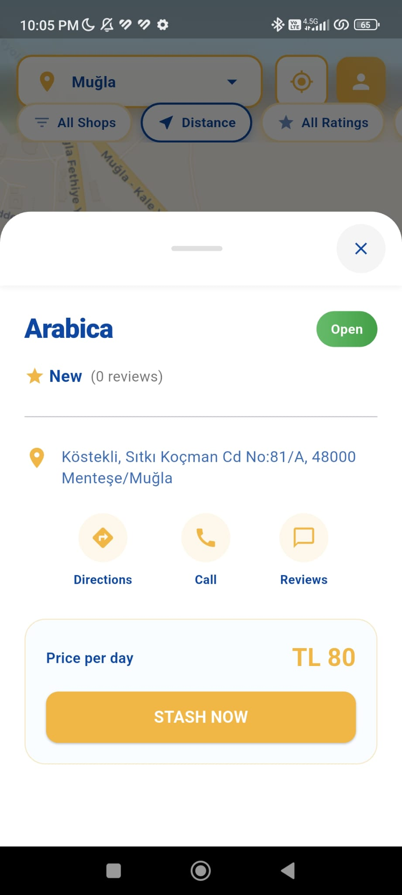
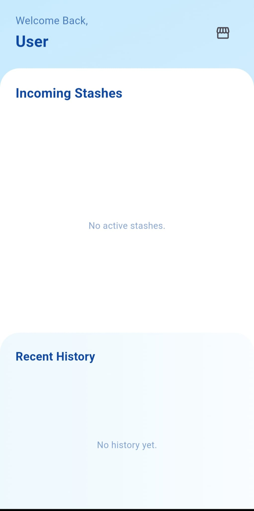
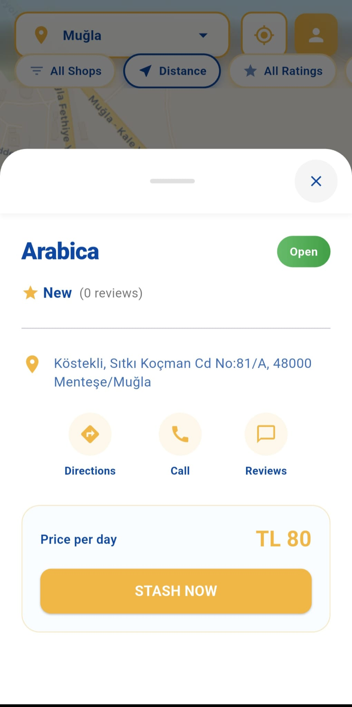
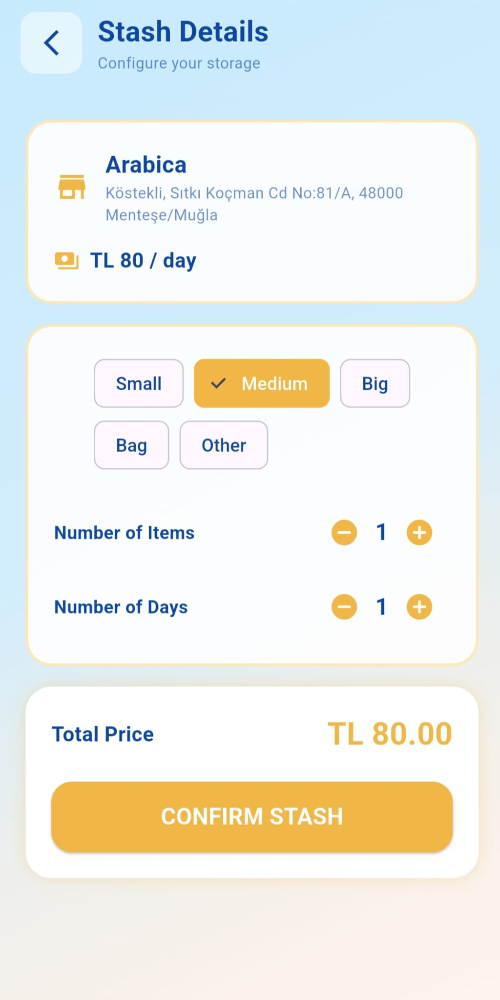
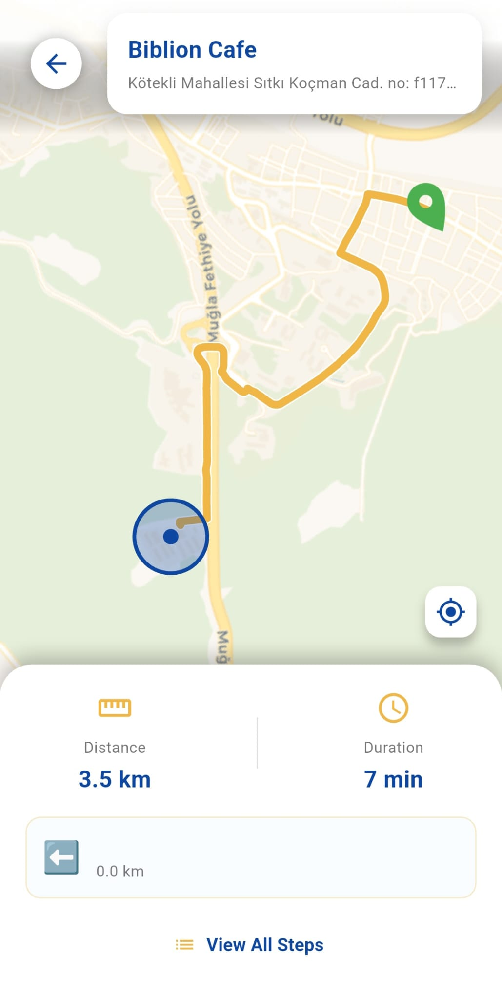

# Stash (Emanet) 🧳

Find nearby baggage storage spots, book fast, and manage reservations in one clean Flutter experience. 📍⚡

===

## Highlights ✨

- Map-first discovery with rich filters (distance, rating, price) 🗺️
- Real-time availability and reservation flow ⏱️
- Separate visitor and employee journeys 🧑‍💼🧑‍🧳
- Firebase-backed auth, analytics, and Firestore data 🔐
- Polished UI with Lottie animations and custom theming 🎨

===

## Screenshots 📸

<table>
  <tr>
    <td align="center">
      
      <br />Lottie Screen
    </td>
    <td align="center">
      
      <br />Stash Screen
    </td>
    <td align="center">
      
      <br />Employee Dashboard
    </td>
  </tr>
  <tr>
    <td align="center">
      
      <br />Shop sheet
    </td>
    <td align="center">
      
      <br />Shop sheet (status bar)
    </td>
    <td align="center">
      
      <br />Map route
    </td>
  </tr>
  <tr>
    <td align="center">
      
      <br />Role selection
    </td>
    <td align="center">&nbsp;</td>
    <td align="center">&nbsp;</td>
  </tr>
</table>

===

## Tech Stack 🧰

- Flutter (Dart)
- Firebase: Auth, Firestore, App Check, Analytics
- Flutter Map, Geolocator, Geocoding
- HTTP + Dio

===

## Quick Start 🚀

1) Make sure Flutter SDK is installed.
2) Install dependencies:

```bash
flutter pub get
```

3) Configure Firebase:

- `lib/firebase_options.dart` is generated by FlutterFire CLI.
- Android: `android/app/google-services.json`
- iOS: `ios/Runner/GoogleService-Info.plist`
- macOS: `macos/Runner/GoogleService-Info.plist`

Update these files to match your Firebase project.

## Run ▶️

```bash
flutter run
```

===

## Cloud Functions (Optional) ☁️

Firebase Functions live under `functions/`.

```bash
cd functions
npm install
npm run serve
```

Note: Firebase CLI is required for emulators.

===

## Project Structure 🧭

- `lib/screens/` UI screens
- `lib/models/` data models
- `lib/services/` service layer
- `lib/utils/` shared utilities
- `assets/` icons, animations, and static data

## Notes 📝

- Map services and the Cloud Function URL are defined in `lib/screens/map_screen.dart`. Update for your environments.
